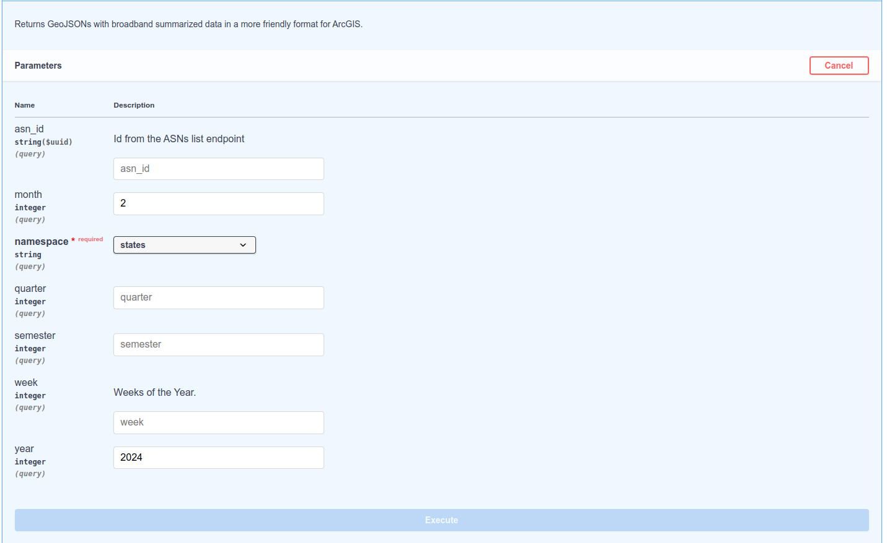

# Broadband Layers in ArcGIS

This page has steps on how to configure ArcGIS to pull our map information from https://broadbandmapping.com in GeoJSON format.

## BroadbandMapping API

To be able to generate a GeoJSON with the data you want, you first need to generate a link with all filters set. These filters work the same way as if you were browsing through [BroadbandMapping](https://broadbandmapping.com).

To help you generate it, go to our [API documentation](https://api.mapping.radartoolkit.com/swagger). It has an interactive UI that lets you try the API, and it has the benefit of generating a URL with all filters applied for you.

### ArcGIS-GeoJSON

1. Select `/arcgis-geojson` endpoint card, it will open a form that you can enable by pressing the "Try it out" button.
2. Fill in the form and click on the "Execute" button.

<figure><figcaption></figcaption></figure>

Once it finishes loading (it could take a few seconds), it will return you a response, with either the generated GeoJSON, or an error message stating that something you've input was wrong. If you see the generated GeoJSON, it means that this link works, and so you can copy the "Request URL" to use it next in ArcGIS.

<figure><figcaption>
Example of a Successfull Request
</figcaption></figure>

<figure><figcaption>
Example of an error message.
</figcaption></figure>

### Filtering by ISPs

If you want to filter by an ISP, you'll notice the API has a field called `asn_id`. This field requires you to pick the internal ID we give to each ISP. For that, you have to go through one extra step, and use our "List ASNs" API. It works the same way as explained in [#arcgis-geojson](broadband-layers-in-arcgis.md#arcgis-geojson "mention"). Put the name of the ISP you wish to browse, hit execute, and grab the Organization ID to use in the `asn_id` input.

<figure><figcaption>
Example of ASN ID browsing
</figcaption></figure>

## Integrating BroadbandMapping with ArcGIS

With the generated URL copied, proceed to ArcGIS, go to the Map Viewer application, select "Add", and pick the "Add Layer from URL" option.

<figure><figcaption>
Add Layer - Add Layer from URL option.
</figcaption></figure>

In the view that opens up, paste the URL, and pick "GeoJSON" for Type.

<figure><figcaption>
Add Layer - Pasting the GeoJSON URL.
</figcaption></figure>

And that's it! Now you have access to our Layers and their data in ArcGIS, you can style it as you like.

<figure><figcaption>
GeoJSON Loaded in ArcGIS
</figcaption></figure>

